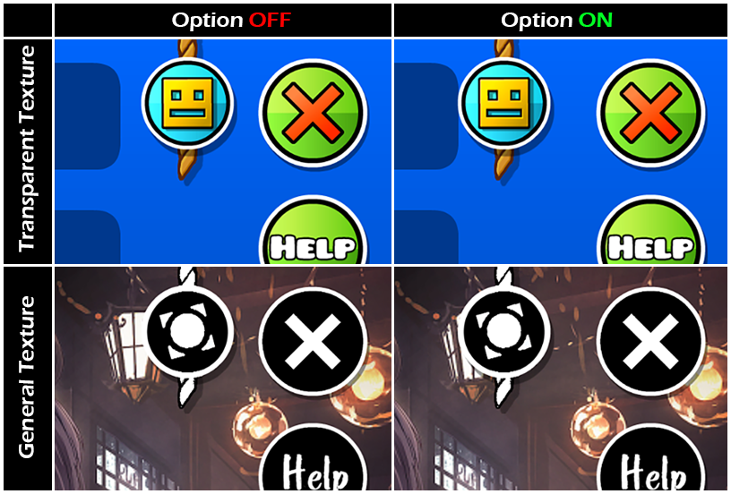

# Garage In Editor

This mod does nothing but adds an extra entry rope button in *EditLevelLayer* (the layer menu where you edit&play&publish your level).
And the rope does wholly the same thing with the one in *LevelInfoLayer* (entrance of a saved level).

### Settings
*Placement Offset* lets you move the rope left or right. Its placement is default to the same with the LevelInfoLayer one.
*Remove Frame* sets the blue Level Title Frame and Level Desc Frame to invisible to fix the UI issue. It's default to activate.

### special Thanks
Huge Thanks to @TheSillyDoggo for helping with the callback function!
